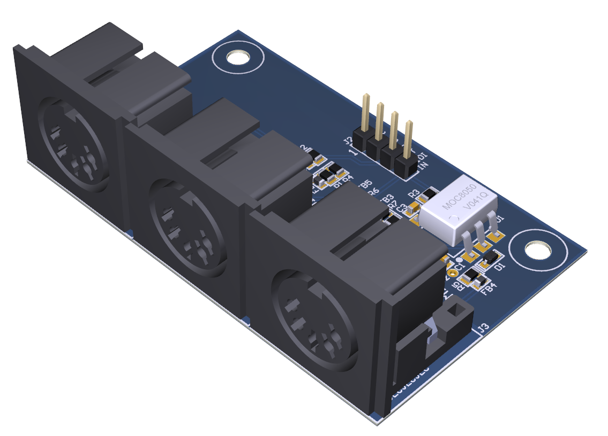
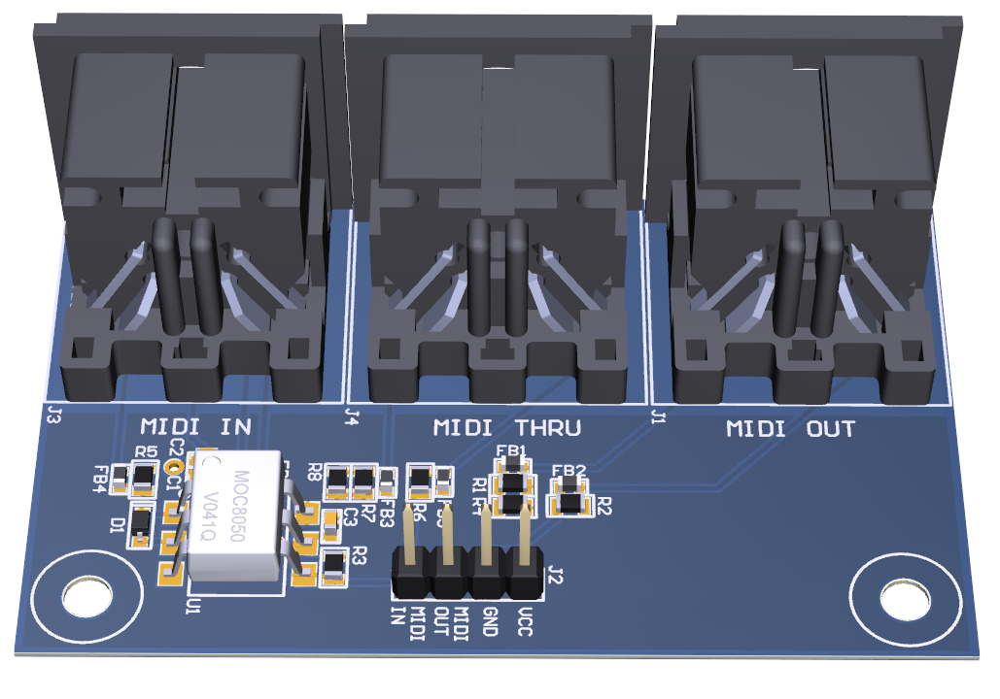

# MIDI-Interface-PCB
This repository contains the Altium Designer PCB project files for a MIDI interface. The PCB was designed following the MIDI Electrical Specification for 3.3V operation. The board includes MIDI IN, OUT and THRU connectors.

## PCB Renders

## PCB Layout

